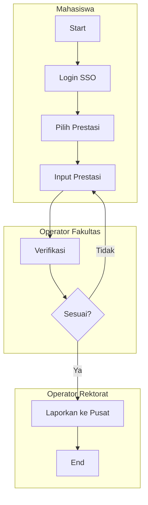
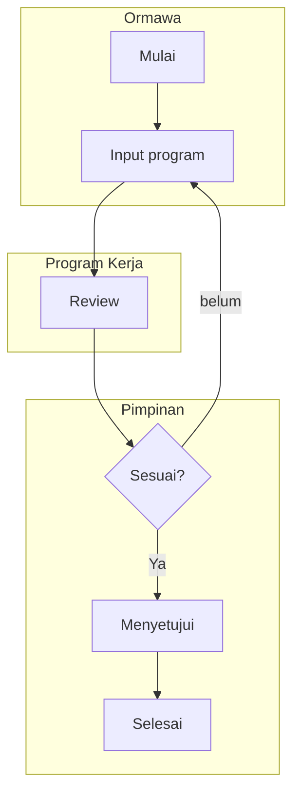
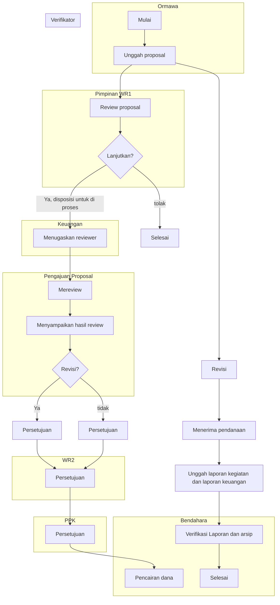

# PANDUAN

## SIMKATMAWA

Prestasi Mahasiswa, Rekognisi, Sertifikasi dan Wirausaha

**UPA TIK**  
**2024**

---


# Proses Bisnis SIMKATMAWA



## Alur Singkat SIMKATMAWA :

- Mahasiswa login melalui sso.undiksha.ac.id
- Mahasiswa memilih prestasi (rekognisi, sertifikasi dan wirausaha)
- Mahasiswa melakukan input prestasi
- Operator Fakultas melakukan verifikasi, jika tidak sesuai mahasiswa dapat melakukan input prestasi kembali. Jika sesuai operator rektorat akan melaporkan ke pusat
- Operator Rektorat melaporkan ke pusat terkait prestasi yang diinputkan

---


# Alur Pengajuan Program Kerja



# Alur Pengajuan Proposal



---


# PANDUAN LOGIN :

1. Silahkan akses sso.undiksha.ac.id. Inputkan username dan password kemudian Klik Login.

**VISI UNDIKSHA :**
MENJADI UNIVERSITAS UNGGUL BERLANDASKAN FALSAFAH TRI HITA KARANA DI ASIA PADA TAHUN 2045

**Misi Undiksha :**

1. Menyelenggarakan pendidikan dan pengajaran yang bermartabat untuk menghasilkan sumber daya manusia yang kompetitif, kolaboratif, dan berkarakter.
2. Menyelenggarakan penelitian yang kompetitif, kolaboratif, dan inovatif untuk pengembangan dan penerapan ilmu pengetahuan dan teknologi.
3. Menyelenggarakan pengabdian kepada masyarakat yang kompetitif, kolaboratif, akomodatif, dan inovatif.

**E-GANESHA LOGIN**
Masukan Username dan Password.

Username: [text input field]
Password: [password input field]

[LOGIN button]

Helpdesk | Lupa Password?

... FAQ | © - Copyright © 2024 Undiksha ...

2. Setelah berhasil login silahkan memilih SIMKATMAWA.

3. **Menu Dashboard.**

Tampilan dashboard SIMKATMAWA menampilkan infografis terkait alur pengajuan program dan pengajuan proposal.

**SIMKATMAWA**

**MENU**
* Dashboard
* Pembiayaan  
* Prestasi
* Bantuan

**Dashboard**
Selamat datang di dashboard Sistem Tata Kelola Kemahasiswaan (SIMKATMAWA)

**Proses Pengajuan Program Kerja**

<table>
<tr>
<td>01</td>
<td>02</td>
<td>03</td>
<td>04</td>
<td>05</td>
<td>06</td>
<td>07</td>
<td>08</td>
<td>09</td>
<td>10</td>
<td>14</td>
</tr>
</table>

[Unduh Infografik button]

---


## 4. Menu Pembiayaan

Pada menu pembiayaan terdapat submenu daftar program kerja, dimana ormawa dapat melakukan pengajuan program kerja selama masa bakti menjabat.

<table>
<tr>
<td>
<strong>SIMKATMAWA</strong><br><br>
<strong>MENU</strong><br>
🏠 Dashboards<br>
💰 <strong>Pembiayaan</strong><br>
    📋 Daftar Program Kerja<br>
🏆 Prestasi<br>
🎁 Bantuan
</td>
<td>
<strong>Daftar Program Kerja</strong><br>
Home > Program Kerja<br><br>
🔍 Search user

---


# 5. Menu Prestasi

## Interface Screenshot - Daftar Prestasi Lomba

**SIMKATMAWA**

**MENU**
* Dashboards
* Pembiayaan  
* Prestasi (highlighted in red box)
  * Lomba Mandiri
* Rekognisi
* Sertifikasi
* Wirausaha
* Bantuan

**Main Content Area:**
Daftar Prestasi Lomba
Home - Prestasi Lomba

[+ Tambah Prestasi] (blue button, highlighted in red box)

Search: Cari Data

<table>
<thead>
<tr>
<th>NO</th>
<th>TANGGAL DIBUAT</th>
<th>KEGIATAN</th>
<th>KOMENTAR</th>
<th>STATUS VERIFIKASI</th>
<th>STATUS TERLAPORKAN</th>
<th>AKSI</th>
</tr>
</thead>
<tbody>
<tr>
<td colspan="7">No data available in table</td>
</tr>
</tbody>
</table>

Showing no records

## A. Lomba Mandiri

Prestasi Lomba Mandiri merupakan penghargaan yang diperoleh secara individu/kelompok. Pencapaian ini mencerminkan kemampuan dan dedikasi pribadi dalam meraih prestasi di berbagai kompetisi Pada menu prestasi lomba mandiri, mahasiswa diminta mengisi form terkait prestasi yang diperoleh. Klik **Tambah Prestasi** untuk menambahkan prestasi lomba. Berikut merupakan tampilan isian form yang harus dilengkapi mahasiswa :

**Form Prestasi Lomba**
Home - Prestasi Lomba - Form

## Form Interface Screenshot

**Form Prestasi Lomba Mandiri** (highlighted in red box)

Prestasi Lomba Mandiri merupakan penghargaan yang diperoleh secara individu/kelompok. Pencapaian ini mencerminkan kemampuan dan dedikasi pribadi dalam meraih prestasi di berbagai kompetisi.

[Peserta Lomba] (button highlighted in red box)

**NIM Ketua dan Anggota** *

NIM pertama adalah ketua kelompok

*Masukkan NIM seluruh anggota yang dipisahkan dengan tanda koma (,). Contoh: 2429101023,2429101123,2229102319

---


## Form Detail Lomba

<table>
<tr>
<td colspan="2" style="background-color: #f8f9fa; padding: 8px; border: 2px solid #dc3545;">Detail Lomba</td>
</tr>
<tr>
<td>Nama Lomba *</td>
<td>Penyelenggara Kegiatan *</td>
</tr>
<tr>
<td><input type="text" style="width: 100%;"></td>
<td><input type="text" style="width: 100%;"></td>
</tr>
<tr>
<td>Jenis Kepesertaan *</td>
<td>Kategori/Klasifikasi Kegiatan *</td>
</tr>
<tr>
<td>
<select style="width: 100%;">
<option>Pilih Kepesertaan...</option>
</select>
</td>
<td>
<select style="width: 100%;">
<option>Kategori...</option>
</select>
</td>
</tr>
<tr>
<td>Jumlah Perguruan Tinggi (PT) yang terlibat *</td>
<td>Jumlah Negara yang Terlibat (untuk kategori Internasional) *</td>
</tr>
<tr>
<td>
<select style="width: 100%;">
<option>Jumlah PT...</option>
</select>
</td>
<td>
<select style="width: 100%;">
<option>Jumlah Negara...</option>
</select>
</td>
</tr>
<tr>
<td>Jumlah Peserta *</td>
<td>Capaian Prestasi *</td>
</tr>
<tr>
<td><input type="text" style="width: 100%;"></td>
<td>
<select style="width: 100%;">
<option>Capaian Prestasi...</option>
</select>
</td>
</tr>
<tr>
<td>Tanggal Mulai Pelaksanaan *</td>
<td>Tanggal Akhir Pelaksanaan *</td>
</tr>
<tr>
<td><input type="date" style="width: 100%;"></td>
<td><input type="date" style="width: 100%;"></td>
</tr>
</table>

**Url Kegiatan ***
```
www.lombacoding
```

**Foto Kegiatan (Diutamakan foto upacara penyerahan penghargaan) ***

Choose File: `sim1.png`  
Format yang diterima: *.pdf, Maksimal ukuran file 2Mb

**Sertifikat yang Dikeluarkan Panitia Penyelenggara ***

Choose File: `KDN-2012011004_signed.pdf`  
Format yang diterima: *.pdf, Maksimal ukuran file 2Mb

**Surat Tugas/Surat Izin/Surat Undangan Dari Panitia Penyelenggara ***

Choose File: `KDN-2012011004_signed.pdf`  
Format yang diterima: *.pdf, Maksimal ukuran file 2Mb

## Form Dosen Pembimbing. Klik Simpan jika data yang diinputkan dirasa sudah benar.

<table>
<tr>
<td colspan="2" style="background-color: #f8f9fa; padding: 8px; border: 2px solid #dc3545;">Data Dosen Pembimbing</td>
</tr>
<tr>
<td colspan="2">Nama Dosen Pembimbing *</td>
</tr>
<tr>
<td colspan="2">
<select style="width: 100%;">
<option>Pilih Nama Dosen</option>
</select>
</td>
</tr>
<tr>
<td>NIDN *</td>
<td>NIP *</td>
</tr>
<tr>
<td><input type="text" style="width: 100%;"></td>
<td><input type="text" style="width: 100%;"></td>
</tr>
<tr>
<td>Prodi *</td>
<td>Fakultas *</td>
</tr>
<tr>
<td><input type="text" style="width: 100%;"></td>
<td><input type="text" style="width: 100%;"></td>
</tr>
</table>

**Surat Tugas Dosen Pembimbing ***

Choose File: `No file chosen`  
Format yang diterima: *.pdf, Maksimal ukuran file 2Mb

**No HP/WhatsApp Dosen Pembimbing (Apabila ingin memperbaharui nomor) ***

<input type="text" style="width: 100%;">

<button style="background-color: #28a745; color: white; padding: 8px 16px; border: none;">💾 Simpan</button>

---


- Setelah berhasil simpan, form prestasi lomba mandiri akan menunggu verifikasi yang akan dilakukan oleh operator fakultas

<table>
<thead>
<tr>
<th colspan="2">Form Prestasi Lomba Mandiri</th>
</tr>
</thead>
<tbody>
<tr>
<td colspan="2">Prestasi Lomba Mandiri merupakan penghargaan yang diperoleh secara individu/kelompok. Pencapaian ini mencerminkan kemampuan dan dedikasi pribadi dalam meraih prestasi di berbagai kompetisi.</td>
</tr>
<tr>
<td>🏆</td>
<td><strong>Made Yuda Sadewa</strong><br>Ilmu Komputer (S2)<br>📞 081574562331<br><span style="background-color: red; color: white; padding: 2px 4px;">Menunggu verifikasi</span></td>
</tr>
</tbody>
</table>

- **Perbaikan Ajuan**. Pada bagian ini mahasiswa dapat melakukan perbaikan data dengan mengklik tombol `Edit Ajuan` kemudian sesuaikan dengan komentar yang diberikan oleh verifikator. **Data yang sudah diverifikasi tidak bisa diubah atau dihapus.**

<table>
<thead>
<tr>
<th colspan="2">Perbaikan Ajuan</th>
</tr>
</thead>
<tbody>
<tr>
<td colspan="2">Pada bagian ini, Anda dapat melakukan perbaikan data dengan mengklik tombol "Edit" kemudian sesuaikan dengan komentar yang diberikan oleh verifikator. Data yang sudah diverifikasi tidak bisa diubah/dihapus!</td>
</tr>
<tr>
<td><strong>Komentar</strong></td>
<td></td>
</tr>
<tr>
<td colspan="2" style="text-align: center;">
<button style="background-color: red; color: white;">🗑️ Hapus Ajuan</button>
<button style="background-color: orange; color: white;">✏️ Edit Ajuan</button>
</td>
</tr>
</tbody>
</table>

B. **Rekognisi**. Form rekognisi ini mencakup berbagai kegiatan seperti penelitian, publikasi, penjurian, pemakalah, dan peran sebagai narasumber yang dapat diakui dan dihargai dalam pengembangan keilmuan dan profesionalisme.

<table>
<thead>
<tr>
<th rowspan="8">SIMKATMAWA<br><br>MENU<br>📊 Dashboards<br>💰 Pembiayaan<br>🏆 Prestasi<br>   📋 Lomba Mandiri<br>   🎖️ Rekognisi<br>   📜 Sertifikasi<br>   💼 Wirausaha<br>❓ Bantuan</th>
<th colspan="7">Daftar Prestasi Lomba</th>
</tr>
<tr>
<td colspan="7">Home > Rekognisi</td>
</tr>
<tr>
<td colspan="6"></td>
<td><button style="background-color: blue; color: white;">➕ Tambah Rekognisi</button></td>
</tr>
<tr>
<td colspan="7">Search: Cari Data</td>
</tr>
<tr>
<th>NO</th>
<th>TANGGAL DIBUAT</th>
<th>KEGIATAN</th>
<th>KOMENTAR</th>
<th>STATUS VERIFIKASI</th>
<th>STATUS TERLAPORKAN</th>
<th>AKSI</th>
</tr>
<tr>
<td colspan="7" style="text-align: center;">No data available in table</td>
</tr>
<tr>
<td colspan="7">Showing no records</td>
</tr>
</tbody>
</table>


---


Klik Tambah Rekognisi, kemudian lengkapi formulir seperti tampilan dibawah ini :

**Form Rekognisi**

Form rekognisi mencakup berbagai kegiatan seperti penelitian, publikasi, penjurian, pemakalah, dan peran sebagai narasumber yang dapat diakui dan dihargai dalam pengembangan keilmuan dan profesionalisme.

**Detail Rekognisi**

- Kategori Kegiatan Rekognisi *
  Pilih kategori...

- Nama Kegiatan *

- Url Kegiatan *

- Foto Kegiatan *
  Choose File    No file chosen
  Format yang diterima: *.pdf, Maksimal ukuran file 2Mb

- Sertifikat/Piagam *
  Choose File    No file chosen
  Format yang diterima: *.pdf, Maksimal ukuran file 2Mb

- Scan Surat Pengakuan *
  Choose File    No file chosen
  Format yang diterima: *.pdf, Maksimal ukuran file 2Mb

- Tanggal Mulai Pelaksanaan *

- Tanggal Akhir Pelaksanaan *

- Form Data Karya. Form ini hanya diisi oleh peserta dengan kategori karya mahasiswa.

**Data Karya**

Form ini hanya diisi oleh peserta dengan kategori karya mahasiswa. Abaikan jika Anda bukan mahasiswa atau karya Anda tidak termasuk dalam kategori tersebut.

- Nama Lembaga/Mitra *

- Jenis Karya
  Pilih Jenis Karya...

- Deskripsi Karya

- Manfaat karya

- Nomor Surat Keterangan Pengakuan/Rekognisi Karya

- Tanggal Surat

- Form Dosen Pembimbing, **Klik Simpan** jika data yang diinputkan dirasa sudah benar.

**Data Dosen Pembimbing**

- NIDN/NIDK Dosen Pembimbing *
  Pilih Dosen...

- Scan Surat Tugas Dosen Pembimbing *
  Choose File    No file chosen
  Format yang diterima: *.pdf, Maksimal ukuran file 2Mb

**Simpan**

---


## C. Sertifikasi

Form ini digunakan untuk pendataan dan verifikasi sertifikasi yang telah diperoleh mahasiswa. Pastikan mengisi informasi sertifikasi dengan lengkap dan akurat, karena data ini akan digunakan untuk validasi dan pengakuan kompetensi sebagai mahasiswa.

<table>
<thead>
<tr>
<th>MENU</th>
<th colspan="6">Daftar Sertifikasi</th>
</tr>
</thead>
<tbody>
<tr>
<td>📊 Dashboards</td>
<td colspan="6">Home > Sertifikasi</td>
</tr>
<tr>
<td>💰 Pembiayaan</td>
<td colspan="6"></td>
</tr>
<tr>
<td>🏆 Prestasi</td>
<td colspan="6">+ Tambah Sertifikasi</td>
</tr>
<tr>
<td>🏅 Lomba Mandiri</td>
<td colspan="6"></td>
</tr>
<tr>
<td>🎖️ Rekognisi</td>
<td colspan="6">Search: Cari Data [10 ▼]</td>
</tr>
<tr>
<td style="background-color: #ff6b6b;">📜 Sertifikasi</td>
<td colspan="6"></td>
</tr>
<tr>
<td>💼 Wirausaha</td>
<td colspan="6"></td>
</tr>
<tr>
<td>❓ Bantuan</td>
<td colspan="6"></td>
</tr>
<tr>
<td></td>
<th>NO</th>
<th>TANGGAL DIBUAT</th>
<th>KEGIATAN</th>
<th>KOMENTAR</th>
<th>STATUS VERIFIKASI</th>
<th>STATUS TERLAPORKAN</th>
<th>AKSI</th>
</tr>
<tr>
<td></td>
<td colspan="7">No data available in table</td>
</tr>
<tr>
<td></td>
<td colspan="7">Showing no records</td>
</tr>
</tbody>
</table>

Klik Tambah Sertifikasi untuk menambahkan sertifikasi yang dimiliki. Berikut merupakan tampilan isian form yang harus dilengkapi mahasiswa :

- Detail Kegiatan Sertifikasi

<table>
<thead>
<tr>
<th colspan="2">Form Sertifikasi</th>
</tr>
</thead>
<tbody>
<tr>
<td colspan="2">Home > Sertifikasi > Form</td>
</tr>
<tr>
<td colspan="2"><strong>Form Kegiatan Sertifikasi</strong></td>
</tr>
<tr>
<td colspan="2">Form ini digunakan untuk pendataan dan verifikasi sertifikasi yang telah diperoleh mahasiswa. Pastikan Anda mengisi informasi sertifikasi dengan lengkap dan akurat, karena data ini akan digunakan untuk validasi dan pengakuan kompetensi Anda sebagai mahasiswa</td>
</tr>
<tr>
<td colspan="2" style="background-color: #ff6b6b;"><strong>Detail Kegiatan Sertifikasi</strong></td>
</tr>
<tr>
<td>Nama Skema Sertifikasi *</td>
<td>Nama Lembaga Pemberi Sertifikasi *</td>
</tr>
<tr>
<td>[________________]</td>
<td>[________________]</td>
</tr>
<tr>
<td>Url Kegiatan *</td>
<td>Tanggal Sertifikasi *</td>
</tr>
<tr>
<td>[________________]</td>
<td>[________________]</td>
</tr>
<tr>
<td colspan="2">Sertifikat/Piagam Sertifikasi *</td>
</tr>
<tr>
<td colspan="2">Choose File    No file chosen</td>
</tr>
<tr>
<td colspan="2">Format yang diterima: *.pdf, Maksimal ukuran file 2Mb</td>
</tr>
</tbody>
</table>

- Data Dosen Pembimbing. Klik Simpan jika data yang diinputkan dirasa sudah benar.

<table>
<thead>
<tr>
<th colspan="2">Data Dosen Pembimbing</th>
</tr>
</thead>
<tbody>
<tr>
<td colspan="2">NIDN/NIDK Dosen Pembimbing *</td>
</tr>
<tr>
<td colspan="2">Pilih Dosen</td>
</tr>
<tr>
<td colspan="2">[________________▼]</td>
</tr>
<tr>
<td colspan="2">Scan Surat Tugas Dosen Pembimbing *</td>
</tr>
<tr>
<td colspan="2">Choose File    No file chosen</td>
</tr>
<tr>
<td colspan="2">Format yang diterima: *.pdf, Maksimal ukuran file 2Mb</td>
</tr>
<tr>
<td colspan="2" style="text-align: right;"><button style="background-color: #28a745; color: white;">💾 Simpan</button></td>
</tr>
</tbody>
</table>


---


## D. Wirausaha

Form ini digunakan untuk pendataan kegiatan wirausaha yang dilakukan oleh mahasiswa. Wirausaha yang dapat diajukan berupa wirausaha mandiri atau dari kegiatan PMW.

**SIMKATMAWA Interface - Daftar Wirausaha**

MENU:
- Dashboard
- Pembiayaan
- Prestasi
  - Lomba Mandiri
- Rekognisi
- Sertifikasi
- **Wirausaha** (highlighted)
- Bantuan

**Daftar Wirausaha**
Home - Wirausaha

[+ Tambah Wirausaha] (button highlighted in red box)

<table>
<thead>
<tr>
<th>NO</th>
<th>TANGGAL DIBUAT</th>
<th>KEGIATAN</th>
<th>KOMENTAR</th>
<th>STATUS VERIFIKASI</th>
<th>STATUS TERLAPORKAN</th>
<th>AKSI</th>
</tr>
</thead>
<tbody>
<tr>
<td colspan="7">No data available in table</td>
</tr>
</tbody>
</table>

Search: Cari Data

Showing no records

- Form Kegiatan Wirausaha, melengkapi identitas peserta lomba

**Form Wirausaha**
Home - Wirausaha - Form

**Form Kegiatan Wirausaha** (highlighted in red box)
Form ini digunakan untuk pendataan kegiatan wirausaha yang dilakukan oleh mahasiswa. Wirausaha yang dapat diajukan berupa wirausaha mandiri atau dari kegiatan PMW

**Peserta Lomba**

**NIM Ketua dan Anggota** *
NIM pertama adalah ketua kelompok

*Masukkan NIM seluruh anggota yang dipisahkan dengan tanda koma (,). Contoh: 2429101023,2429101123,2229102319

- Form Detail Wirausaha. Klik **Simpan** jika data yang diinputkan sudah benar dan lengkap.

**Detail Wirausaha** (highlighted in red box)

**Jenis Karya**
Pilih Jenis Karya... ▼

**Laporan Kegiatan** *
Choose File No file chosen
Format yang diterima: *.pdf, Maksimal ukuran file 2Mb format laporan

**Nama Usaha atau Program Wirausaha** *

**Klasifikasi Usaha**
Pilih Klasifikasi Usaha... ▼

**Jabatan di Wirausaha**
Pilih Jabatan... ▼

[Simpan] (green button)

---


[Decorative header with teal/green and blue geometric design elements]

- Setelah berhasil simpan, form wirausaha akan menunggu verifikasi yang akan dilakukan oleh operator fakultas

## Detail Wirausaha

Detail kegiatan wirausaha berisikan data wirausaha yang dilakukan oleh mahasiswa. Wirausaha yang diajukan berupa wirausaha mandiri atau dari kegiatan PMW

**Made Yuda Sadewa**  
Ilmu Komputer (S2)  
🟡 Menunggu verifikasi

# SELAMAT MENCOBA 😊

[Decorative footer with teal/green and blue geometric design elements]
